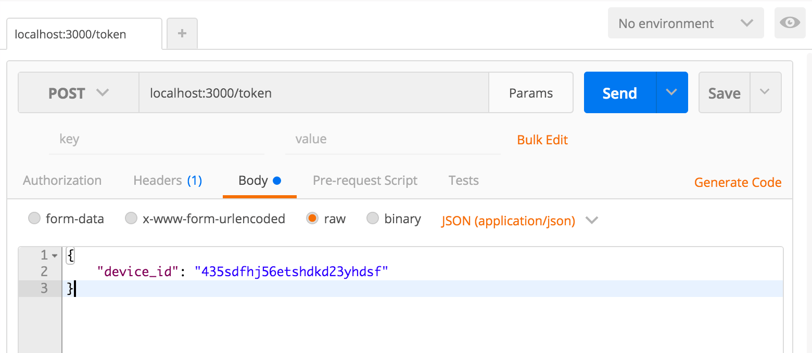

# ramelix
A RAML configuration demo + osprey

## Install

```
npm install -d
```

## How to use

### Use it from `npm scripts`

### Start API REST Server Dummy by port 3000

```
npm start
```

## Testing API

#### URL: http://localhost:3000/token
#### Method: POST
#### Body: Raw / JSON (application/json)

```
{
    "device_id": "dsafs7df68a7sdfkjasdjfjya8sdgfhk"
}
```




### Routes file
```
/routes/raml.js
```

### Generate html

```
npm run html
```

### Executing server documentation by port 8000

```
npm run doc
```

```
http://localhost:8000/
```

### Executing js linter

```
npm run lint
```

### Executing jscomplex

```
npm run jscomplex
```
